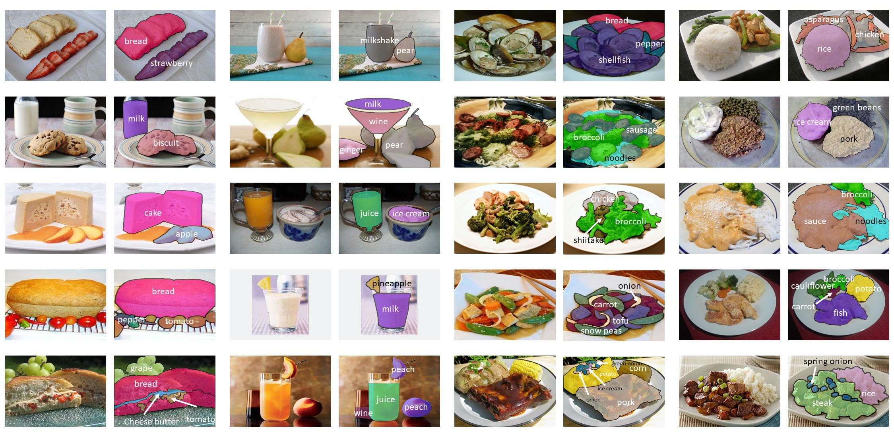

# A Large-Scale Benchmark for Food Image Segmentation

By [Xiongwei Wu](http://xiongweiwu.github.io/), [Xin Fu](https://xinfu607.github.io/), Ying Liu, [Ee-Peng Lim](http://www.mysmu.edu/faculty/eplim/), [Steven C.H. Hoi](https://sites.google.com/view/stevenhoi/home/), [Qianru Sun](https://qianrusun.com/).
  

<div align="center">
  
</div>
<br />

## Introduction

We build a new food image dataset FoodSeg103 containing 7,118 images. We annotate these images with 104 ingredient classes and each image has an average of 6 ingredient labels and pixel-wise masks.
In addition, we propose a multi-modality pre-training approach called ReLeM that explicitly equips a segmentation model with rich and semantic food knowledge.

In this software, we use three popular semantic segmentation methods (i.e., Dilated Convolution based, Feature Pyramid based, and Vision Transformer based) as baselines, and evaluate them as well as ReLeM on our new datasets. We believe that the FoodSeg103 and the pre-trained models using ReLeM can serve as a benchmark to facilitate future works on fine-grained food image understanding. 

Please refer our [paper](https://arxiv.org/abs/2105.05409) and our [homepage](https://xiongweiwu.github.io/foodseg103.html) for more details.

## License

This project is released under the [Apache 2.0 license](LICENSE).


## Installation

Please refer to [get_started.md](docs/get_started.md#installation) for installation. 

## Dataset

Please download FoodSeg103 from [LARC Data Repository](https://larc.smu.edu.sg/foodseg103-benchmark-v1), and unzip it in ./data folder (./data/FoodSeg103/). 


## Leaderboard

Please refer to [leaderboard](https://paperswithcode.com/dataset/foodseg103) in paperwithcode website.

## Benchmark and model zoo

:exclamation::exclamation::exclamation: **We have finished the course so the models are available again. Please download the trained models from THIS [link](https://smu-my.sharepoint.com/:u:/g/personal/xwwu_smu_edu_sg/EWBcCC3QrO9LthKX66QCzyoBhFU7PHXKcHhh1lgIC98uKw?e=bHT7vM):eyes: .**

Encoder | Decoder | Crop Size |  Batch Size |mIoU | mAcc | Link
--- |:---:|:---:|:---:|:---:|:---:|:---:
R-50	|	[FPN](https://arxiv.org/abs/1901.02446)   | 512x1024  | 8           |  27.8   |  38.2    | [Model+Config](https://drive.google.com/drive/folders/1CQ5CXxASAoobj7bKqyuvazkeusqMAM4F?usp=sharing)
ReLeM-R-50	|	FPN   | 512x1024  | 8       |  29.1   |  39.8    | [Model+Config](https://drive.google.com/drive/folders/1m7N2EE8jkX67a0lD6GZ4NQgr4gEcWpDU?usp=sharing)
R-50	|	[CCNet](https://arxiv.org/abs/1811.11721)   | 512x1024  | 8       |  35.5   |  45.3    | [Model+Config](https://drive.google.com/drive/folders/1pNPbtrGqCq_Zlina2PCs6X8bIvY9ZZxG?usp=sharing)
ReLeM-R-50	|	CCNet   | 512x1024  | 8   |    36.8 | 47.4     | [Model+Config](https://drive.google.com/drive/folders/1FWwxAsZzDnBbDBEbohqOA8htyWgMLM4U?usp=sharing)
[PVT-S](https://arxiv.org/abs/2102.12122)	|	FPN   | 512x1024  | 8           |   31.3  | 43.0     | Model+Config
ReLeM-PVT-S	|	FPN   | 512x1024  | 8           | 32.0    | 44.1     | Model+Config
[ViT-16/B](https://openreview.net/forum?id=YicbFdNTTy)	|	[Naive](https://arxiv.org/abs/2012.15840)   | 768x768  | 4           | 41.3    |  52.7    | [Model+Config](https://drive.google.com/drive/folders/19b3VG906CA-5kQFaJVk5U6kDxnw9HcWL?usp=sharing)
ReLeM-ViT-16/B	|	Naive   | 768x768  | 4           | 43.9    |  57.0    | [Model+Config](https://drive.google.com/drive/folders/10yKiu8aMeTGphU2CKT2ybeAC3ezgDnXP?usp=sharing)
ViT-16/B	|	PUP   | 768x768  | 4           |  38.5   | 49.1     | Model+Config
ReLeM-ViT-16/B	|	PUP   | 768x768  | 4           | 42.5    | 53.9     | Model+Config
ViT-16/B	|	[MLA](https://arxiv.org/abs/2012.15840)   | 768x768  | 4           |  45.1   | 57.4     | [Model+Config](https://drive.google.com/drive/folders/17Ht1HQDaBJmS0FXaXGjHk0VQNhAJxrlF?usp=sharing)
ReLeM-ViT-16/B	|	MLA   | 768x768  | 4           | 43.3    | 55.9     | [Model+Config](https://drive.google.com/drive/folders/12OlkStefNmELNLo-xJqc-lE-kPZ7DvPV?usp=sharing)
[ViT-16/L](https://openreview.net/forum?id=YicbFdNTTy)	|	MLA   | 768x768  | 4           |  44.5   |   56.6   | [Model+Config](https://drive.google.com/drive/folders/1PS4uh2zktNc0hh-mSLZkRTqgNnkfh7xu?usp=sharing)
[Swin-S](https://arxiv.org/abs/2103.14030)	|	[UperNet](https://arxiv.org/abs/1807.10221)   | 512x1024  | 8           |  41.6   |  53.6    | [Model+Config](https://drive.google.com/drive/folders/1E5fZga8h65dNZCX1m8zywvB8MwrleFNg?usp=sharing)
[Swin-B](https://arxiv.org/abs/2103.14030)	|	UperNet   | 512x1024  | 8           |  41.2   |  53.9    | [Model+Config](https://drive.google.com/drive/folders/1kqOsH51h1pa-88tbFVUV3mmzTNCGzqd0?usp=sharing)


[1] *We do not include the implementation of [swin](https://arxiv.org/abs/2103.14030) in this software. You can use the official [implementation](https://github.com/SwinTransformer/Swin-Transformer-Semantic-Segmentation) based on our provided models.* \
[2] *We use Step-wise learning policy to train PVT model since we found this policy can yield higher performance, and for other baselines we adopt the default settings.* \
[3] *We use Recipe1M to train ReLeM-PVT-S while other ReLeM models are trained with Recipe1M+ due to time limitation.*


## Train & Test

Train script:

```
 CUDA_VISIBLE_DEVICES=0,1,2,3  python -m torch.distributed.launch --nproc_per_node=4 --master_port=${PORT:-300}    tools/train.py --config [config]  --work-dir [work-dir]  --launcher pytorch
```

Exmaple:

```
 CUDA_VISIBLE_DEVICES=0,1,2,3  python -m torch.distributed.launch --nproc_per_node=4 --master_port=${PORT:-300}    tools/train.py --config configs/foodnet/SETR_Naive_768x768_80k_base_RM.py  --work-dir  checkpoints/SETR_Naive_ReLeM  --launcher pytorch
```

Test script:

```
 CUDA_VISIBLE_DEVICES=0,1,2,3  python  -m torch.distributed.launch --nproc_per_node=4  --master_port=${PORT:-999} tools/test.py  [config]   [weights]  --launcher pytorch --eval mIoU
```

Example:

```
 CUDA_VISIBLE_DEVICES=0,1,2,3  python  -m torch.distributed.launch --nproc_per_node=4  --master_port=${PORT:-999} tools/test.py  checkpoints/SETR_Naive_ReLeM/SETR_Naive_768x768_80k_base_RM.py   checkpoints/SETR_Naive_ReLeM/iter_80000.pth  --launcher pytorch --eval mIoU
```

## ReLeM
We train recipe information based on the implementation of [im2recipe](https://github.com/torralba-lab/im2recipe-Pytorch) with small modifications, which is trained on [Recipe1M+](http://pic2recipe.csail.mit.edu/) dataset (test images of FoodSeg103 are removed). I may upload the lmdb file later due to the huge datasize (>35G).

It takes about 2~3 weeks to train a ReLeM ViT-Base model with 8 Tesla-V100 cards, so I strongly recommend you use my pre-trained models([link](https://drive.google.com/drive/folders/1LRCHxeMuCXMb68I1XFI8q-aQ2cCyUx_r?usp=sharing)).


## Citation

If you find this project useful in your research, please consider cite:

```latex
@inproceedings{wu2021foodseg,
	title={A Large-Scale Benchmark for Food Image Segmentation},
	author={Wu, Xiongwei and Fu, Xin and Liu, Ying and Lim, Ee-Peng and Hoi, Steven CH and Sun, Qianru},
	booktitle={Proceedings of ACM international conference on Multimedia},
	year={2021}
}
```

## Other Issues

If you meet other issues in using the software, you can check the original mmsegmentation (see [doc](https://mmsegmentation.readthedocs.io/) for more details).


## Acknowledgement

The segmentation software in this project was developed mainly by extending the [segmentation](https://github.com/open-mmlab/mmsegmentation/). 
 
